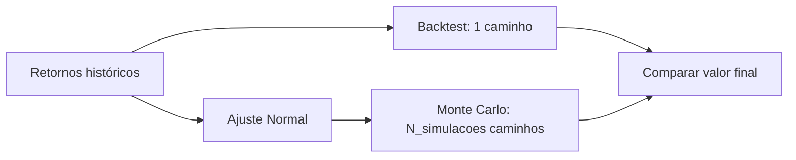

# Backtest e Monte Carlo — NimbusPay

Projeto em Python que modela o valor de uma empresa fictícia (**NimbusPay**, fintech B2B), executa um **backtest** sobre retornos mensais históricos, simula cenários futuros com **Monte Carlo** usando a **mesma distribuição** de retornos e compara o resultado histórico com a **média das simulações**.

---

## Objetivo

| Passo | Descrição |
|:-----:|-----------|
| **1** | Escolher a empresa/ideia e construir a série de retornos → gerar o caminho de **backtest** |
| **2** | Estimar distribuição Normal nos retornos históricos e simular `N_simulacoes` trajetórias com `N_periodos` meses |
| **3** | Comparar o **valor final do backtest** com a **média dos valores finais** do Monte Carlo |

---

## Requisitos

- **Python 3.10+** (testado em 3.14)
- Apenas biblioteca **padrão** para executar o script principal
- **matplotlib** (opcional) — apenas se usar `--grafico`

```powershell
# Opcional — gráficos
pip install matplotlib
```

---

## Execução rápida

```powershell
cd c:\UCL\PO
python monte_carlo_backtest.py --N_simulacoes 10000 --N_periodos 36
```

### Argumentos

| Argumento | Obrigatório | Descrição |
|-----------|:-----------:|-----------|
| `--N_simulacoes` | Sim | Número de simulações Monte Carlo |
| `--N_periodos` | Sim | Número de meses por simulação |
| `--seed` | Não | Semente aleatória (padrão: `42`) |
| `--grafico` | Não | Gera `resultado_monte_carlo.png` |

### Exemplos

```powershell
# Referência do projeto (36 meses = histórico)
python monte_carlo_backtest.py --N_simulacoes 10000 --N_periodos 36

# Horizonte mais curto
python monte_carlo_backtest.py --N_simulacoes 5000 --N_periodos 24

# Com gráfico
python monte_carlo_backtest.py --N_simulacoes 10000 --N_periodos 36 --grafico
```

---

## Resultados (execução de referência)

Configuração: `N_simulacoes=10000`, `N_periodos=36`, `seed=42`, valor inicial **1 000 000 EUR**.

### Empresa e distribuição

| Item | Valor |
|------|-------|
| Empresa | NimbusPay — Fintech B2B (pagamentos para PME) |
| Valor inicial | 1 000 000,00 EUR |
| Horizonte histórico | 36 meses |
| Distribuição MC | Normal(media=**1,0833 %**/mês, desvio=**1,3388 %**/mês) |

### Passo 1 — Backtest (caminho histórico)

| Métrica | Resultado |
|---------|----------:|
| Valor final | **1 469 357,02 EUR** |
| Retorno total (36 meses) | **+46,94 %** |
| Meses positivos / negativos | 27 / 9 |

### Passo 2 — Monte Carlo (10 000 simulações × 36 meses)

| Métrica | Resultado |
|---------|----------:|
| Média do valor final | 1 474 313,55 EUR (+47,43 %) |
| Mediana do valor final | 1 469 366,71 EUR (+46,94 %) |
| Intervalo 90 % (P5 – P95) | 1 288 857,88 – 1 678 003,64 EUR |

### Passo 3 — Comparação

| Indicador | Backtest | Média MC | Diferença |
|-----------|----------:|---------:|----------:|
| Valor final | 1 469 357,02 EUR | 1 474 313,55 EUR | +4 956,53 EUR |
| Retorno total | +46,94 % | +47,43 % | +0,49 p.p. |
| Diferença relativa | — | — | **+0,34 %** |

A mediana Monte Carlo (~1,47 M EUR) coincide quase com o valor final do backtest: o histórico é **uma realização** da mesma dinâmica; a **média** de muitas simulações aproxima o valor **esperado** sob a Normal estimada.

### Saída no terminal (exemplo)

```
========================================================================
Empresa: NimbusPay — Fintech B2B (pagamentos para PME)
...
Distribuicao: normal(media=0.010833, desvio=0.013388) | media historica: 1.0833% ...

Monte Carlo: N_simulacoes=10000, N_periodos=36

--- Comparação (passo 3) ---
  Valor final backtest (passo 1):       1,469,357.02 EUR
  Valor final media MC (passo 2):       1,474,313.55 EUR
  Diferenca relativa:                          0.34%
  ...
  IC 90% (P5-P95):                    [1,288,857.88, 1,678,003.64] EUR
========================================================================
```

---

## Metodologia (resumo)

### Retorno e valor

Em cada mês \(t\):

\[
V_t = V_{t-1} \cdot (1 + r_t)
\]

- **Backtest:** usa os 36 retornos históricos fixos definidos em `EMPRESA`.
- **Monte Carlo:** em cada mês sorteia \( \tilde{r} \sim \mathcal{N}(\bar{r}, s) \), com \(\bar{r}\) e \(s\) calculados nos retornos históricos.

### Fluxo do programa



---

## Estrutura do repositório

| Ficheiro | Descrição |
|----------|-----------|
| `monte_carlo_backtest.py` | Script principal (backtest + MC + comparação) |
| `DADOS_VALORES_RETORNOS.md` | Tabelas detalhadas: todos os retornos, trajetória \(V_t\), estatísticas |
| `requirements.txt` | Dependências opcionais |
| `README.md` | Este ficheiro |

---

## Personalizar a empresa

Edite o bloco `EMPRESA` em `monte_carlo_backtest.py`:

```python
EMPRESA = Empresa(
    nome="...",
    setor="...",
    descricao="...",
    valor_inicial=1_000_000.0,
    retornos_mensais=( ... ),  # 36 retornos decimais
)
```

Depois volte a executar o script. Para documentação numérica completa, atualize também `DADOS_VALORES_RETORNOS.md`.

---

## Documentação detalhada

Para tabelas mês a mês, fórmulas, marcos da trajetória e glossário:

**[DADOS_VALORES_RETORNOS.md](DADOS_VALORES_RETORNOS.md)**

---

## Notas

- `N_periodos` no Monte Carlo **não tem** de ser 36; se for diferente do histórico, a comparação com o backtest de 36 meses deixa de ser direta.
- Resultados MC variam com `--seed` e `--N_simulacoes`; os valores deste README usam a configuração de referência acima.
- A série de retornos é **sintética** (fictícia), apenas para exercício académico / análise quantitativa.
